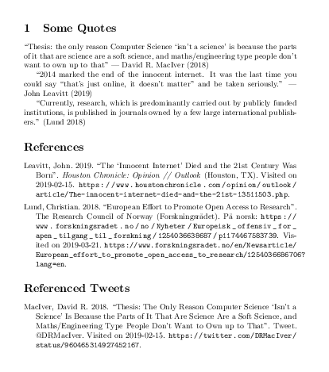
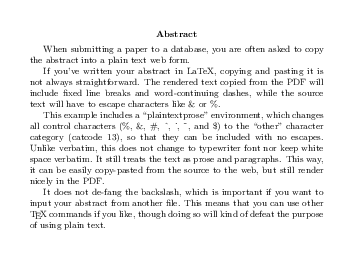

LaTeX Examples
==================================================

This is a repository of minimal working examples (MWEs) for several LaTeX
tricks, as I pick them up and find them useful.

Originally, many of these were lumped together in one template.
But the template got very bloated, very fast.
So it made more sense to separate them out into
simple examples that could be composed into new documents.

List of Examples
--------------------------------------------------

### Sanitizing .bib data

[biblatex-transforms-declaresourcemap.tex](biblatex-transforms-declaresourcemap.tex)

An example of how to use Biblatex's DeclareSourcemap command to massage incoming data.
This example specifically tweaks bib data exported from Zotero.
It includes tweaks such as renaming fields, fixing timestamp format, and fixing quote nesting.



### Chapter/section intro quotes

[epigraphs-and-pull-quotes.tex](epigraphs-and-pull-quotes.tex)

A few examples of "epigraph" pull quotes to introduce chapters or sections.
It shows the use of the epigraph package, and how to roll your own command.


### Including git history

[git-log.tex](git-log.tex)

A macro that adds a Git log section, as long as the document is not `final`.
It requires a little help from the Makefile to dump the git log into a file,
but the comments in the example and the
[Makefile](Makefile) in this repository show you how to do that.


### Writing prose without having to escape %, &, etc.

[plain-text-prose.tex](plain-text-prose.tex)

A macro that de-fangs LaTeX control characters, so you can write prose without worrying about escaping them.
Especially useful if you need to copy and paste an abstract into a web form when submitting a paper.



### Setting text aside while rewriting it

[scratch-text-blocks.tex](scratch-text-blocks.tex)

A macro that marks text (even large blocks) for deletion.
Without the `final` option, the text will be greyed out, but left in the document.
With the `final` option, it text will be excluded altogether.


Building the Examples, an example Makefile
--------------------------------------------------

This build is controlled by Make. The main targets are `all` (the default) and `clean`.

```bash
# Default make
make
# Clean and remake
make clean all
```

These examples may require various LaTeX packages.
But they shouldn't need anything too exotic
outside of a standard TeX Live installation.

The [Makefile](Makefile) itself provides examples of Make tricks for LaTeX used
in this repository, including:

- Generic rules for making LaTeX, with and without bibliography
- Generating a separate `final` version of the document,
    using sed to uncomment a `%final` in the `documentclass` declaration
- Generating a PNG preview of a PDF,
    using ImageMagick to crop, color in background, and convert to PNG.
    It also omits the usual embedded timestamp data so that the PNGs will be
    deterministic and not confuse Git.

LaTeX Tips
==================================================

Bibliographies
--------------------------------------------------

### Bibliography references and resources

- The LaTeX Wikibook: [Bibliography Management](https://en.wikibooks.org/wiki/LaTeX/Bibliography_Management),
    including the [Biblatex section](https://en.wikibooks.org/wiki/LaTeX/Bibliography_Management#biblatex)
- The LaTeX Wikibook: [More Bibliographies](https://en.wikibooks.org/wiki/LaTeX/More_Bibliographies)
- The [Biblatex Cheat Sheet](http://tug.ctan.org/info/biblatex-cheatsheet/biblatex-cheatsheet.pdf) by  Clea F. Rees
- The Biblatex docs: `texdoc biblatex`
- The documents for particular styles (e.g. `texdoc biblatex-chicago` or `biblatex-mla`)
    often list their specific fields and how they're used.

### Debugging bibliographies

- Use the `showkeys` package (`\usepackage{showkeys}`) to show reference keys throughout the document.

- Look at the output log: `*.log`.
    Search especially for warnings and for package names.

- Look at the generated bibliography information in the `*.bbl` file.
    It will show you what information is being successfully parsed from your
    `*.bib` files by LaTeX, and it will include warnings. If something is
    missing or incorrect here, you can to use `DeclareSourcemap` to massage the
    information as Biblatex processes it. See the
    [biblatex-transforms-declaresourcemap.tex](biblatex-transforms-declaresourcemap.tex)
    example.

- Pass `style=debug` to the biblatex package
    to print the bibliography as a table of keys and values.
    This will basically be the same info as in the `.bbl` file.

- Look at the `texdoc` for `biblatex` and for the style you're using:
    `biblatex-apa`, `biblatex-mla`, `biblatex-chicago`, etc.

- In Debian/Ubuntu, Biblatex styles are in the `texlive-bibtex-extra` apt
  package. Use `apt show texlive-bibtex-extra` to list all that are installed.
  Usually named `biblatex-*`.

For the serious details of the output style,
look at the `.bbx` definition files that are loaded.

- Look at your `.log` to see what is being loaded (search for your bib style
  package name, `apa`, `mla`, etc.)
- They are probably something like:
  `/usr/share/texlive/texmf-dist/tex/latex/biblatex-chicago/chicago-authordate.bbx`
- View those files and try to follow the LaTeX programming they use to display
  the bibliography.
